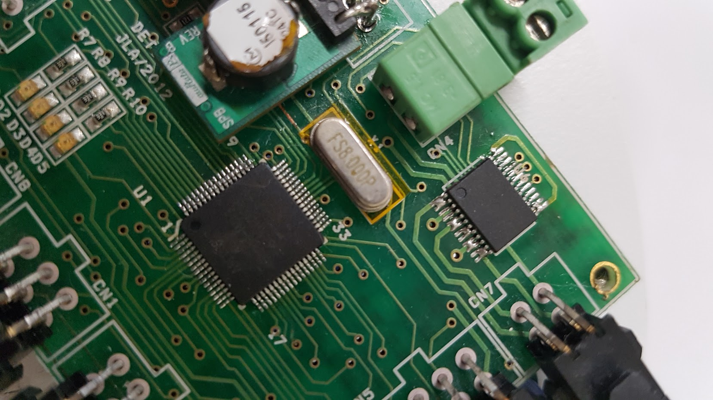

---
# Template para apresentação dos projetos desenvolvidos em 41686 - Projeto em Engenharia de Automação Industrial
# O template tem uma primeira parte com dados sobre o projeto. Após a linha com três traços
# ---
# começa o texto da página web do projeto.
#
# Esta página está escrita em linguagem markdown. Podem encontrar informação sobre a linguagem markdown em https://www.markdownguide.org/
# 
# O site é construído com Jekyll (https://jekyllrb.com/). Têm mais alguma informação sobre o markdown em Jekyll em https://www.markdownguide.org/tools/jekyll/
#
# Não apagar a linha acima com três traços!

# Estes são os campos a adaptar para cada um dos grupos
title:      "Grupo 00 - Wonderful project"
group:      Grupo 00
projname:   Wonderful project
resumo: >- # C código ">-" serve para definir este campo com várias linhas até ao próximo campo (neste caso "company:")
        Lorem ipsum dolor sit amet, consectetur adipiscing elit, sed do eiusmod tempor incididunt ut labore et dolore magna aliqua. Risus nec feugiat in fermentum posuere urna nec. Convallis tellus id interdum velit laoreet id. Quis varius quam quisque id diam. Purus sit amet luctus venenatis lectus. Tortor condimentum lacinia quis vel eros donec ac. Id diam maecenas ultricies mi eget mauris pharetra et ultrices. Malesuada proin libero nunc consequat. Urna condimentum mattis pellentesque id nibh tortor id aliquet. Aliquet bibendum enim facilisis gravida neque convallis a. Neque gravida in fermentum et sollicitudin ac. Integer enim neque volutpat ac tincidunt vitae semper.
        
        Tempor id eu nisl nunc mi ipsum. Rhoncus est pellentesque elit ullamcorper dignissim cras. Et odio pellentesque diam volutpat. Condimentum id venenatis a condimentum vitae. Vitae suscipit tellus mauris a diam maecenas sed enim ut. Varius quam quisque id diam vel quam elementum. Placerat vestibulum lectus mauris ultrices eros in. Neque aliquam vestibulum morbi blandit cursus risus at. Pharetra vel turpis nunc eget. Adipiscing bibendum est ultricies integer quis auctor elit sed vulputate. Enim lobortis scelerisque fermentum dui. Lorem sed risus ultricies tristique nulla aliquet enim. Posuere lorem ipsum dolor sit amet consectetur adipiscing elit. Eu augue ut lectus arcu bibendum at varius vel pharetra. Tristique nulla aliquet enim tortor at auctor urna.

company:    The company
companyURL: https://thecompany.com/

# Orientadores do projeto.
# Esta estrutura é uma lista em YAML, com o nome, email e organização (departamento da Universidade, empresa, ...) de cada orientador.
supervisors:
  - name: First supervisor
    email: first.supervisor@ua.pt
    organization: DETI
    organizationURL: http://www.ua.pt/DETI

  - name:  Company supervisor 1
    email: first.supervisor@thecompany.com
    organization: The Company
    organizationURL: https://thecompany.com/

  - name:  Company supervisor 2
    email: second.supervisor@thecompany.com
    organization: The Company
    organizationURL: https://thecompany.com/

# Team members
# Coordinator comes first
team:
- name: Nome1
  email: nome1@ua.pt
  role: coordinator

- name: Nome2
  email: nome2@ua.pt
  role: developer

- name: Nome3
  email: nome3@ua.pt
  role: developer

# Multimedia...
# Indicar nome dos ficheiros com o video do projeto e a imagem reoresentativa do projeto.
videoFilename:  Group00/Electronics.mp4
thumbnailImage: Group00/Electronics.jpg
# Não devem alterar as duas linhas seguintes (até à linha com "---")
layout: page
categories: pind
---

<!-- Info sobre o projeto -->
<!-- Não devem apagar a linha com o "include projinfo.md" -->


<!-- A partir deste ponto, e até ao final, está a descrição do vosso projeto -->

This should be the full project description. Do not repeat what is in the summary above.

# Challenge

Proposed challenge, initial specifications

# Results

Outcome. What was achieved with the project.

# More information

All other information to help the reader understand the project and the team's achievements: photos of the system under construction, diagrams, tests, ...

Remember that the aim is to present what has been achieved with the project and the value of the project for its users. The advantages of the project, the raison d'être of the project, should be clear to anyone reading the page. Technical details are relevant, but they should be used sparingly and to emphasise the achievements of your project and to the extent that they are useful for understanding the outcome of the project.

## How to include images and tables

The markdown language has specific commands for including pictures and tables, which are simpler than the corresponding HTML codes. The code for including an image is as follows:

To avoid conflicts, images and other elements used on the project page are placed inside the folder with the group number. As the position of these images is defined in relative to the project page, you should always add `Groupnn/` before the image name, where *nn* is the group number (see the examples with group 00).

If you need to define the size of the image, you can use the following example [^note]:

[^note]: Not all Markdown interpreters support this formatting. 

{: width=‘250’}

Tables can also be created using markdown. The structure is as follows:

| Header One | Header Two | Header Three |
| :----------- | :---------------: | -----------: |
| Item One | Item Two | Another one |
| Another item | A centred column | A long text, This column is right justified |

As an alternative to Markdown syntax, you can always use html syntax. Although more complex, it's also safer when you need to manipulate the elements you want to display. For example, changing the size of an image (not all MarkDown interpreters support the formats indicated above) or defining the formatting of a table (background colour, width and type of lines, ...).

In tables too: 

<table>
  <caption> Table legend </caption>
  <tr>
    <th>Header One</th>
    <th>Header Two </th>
  </tr>
  <tr>
    <td> Item one </td>
    <td> Item Two </td>
  </tr>
  <tr>
    <td> Another Item</td>
    <td>And another one</td>
  </tr>
  <tr>
      <td colspan="2" style="text-align: centre;">Two columns</td>
  </tr>
</table>
